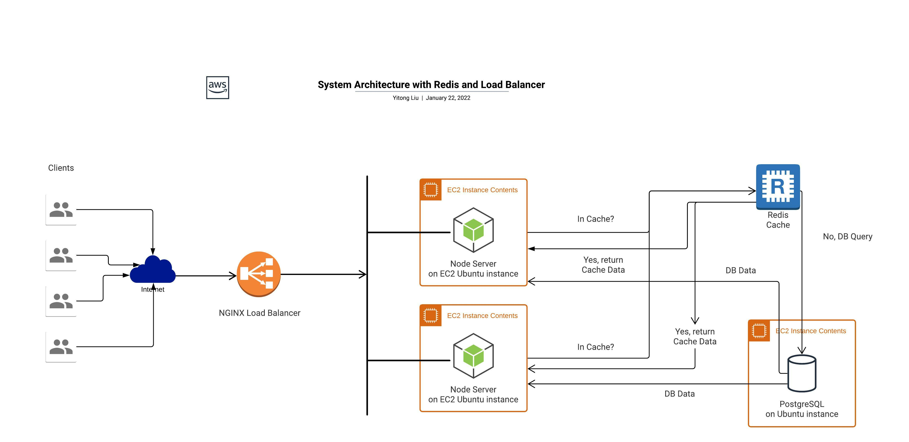
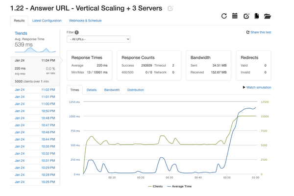

# Q&A-MircoService-API

## Overview
- Create an API that serves product questions and answers to a retail portal. The API will serve up to 10 million rows of data in regards to product questions, product answers and photos

## Mission
- The ultimate goal for this service was to have the deployed application handle up to a 1000 client requests per second while keeping an error rate under 1% and query speeds under 2000ms


## Accomplishment
- Utilized both pgAdmin4 and copy command to extract, transfer and load CSV files containing up to 10 million rows into local database
- Reduced query speeds on local machine to under 5ms for each endpoint using indexing and querying data in postgres with aggregate functions
- Used K6 in conjunction with New Relic to monitor system performance and deduce bottelnecks
- Tested for the first 10%, middle and last 10% of rows when testing with K6 to account for any edge cases or slowdowns
- API was deployed onto 5 AWS EC2 Instance (T2.micro) to horizontally scale application
- NGINX proxy server was deployed to route client traffic across multiple instances
- Loader.IO was implemented to stress test deployed application
- Utilized caching within load balancer to reduce query times on endpoints to under 20ms on deployed service

## Final Architechture


## Testing Result



## Installation
```html
  Run all commands in root directory
  // install modules
  npm install
  // Start Server
  npm run start

```
